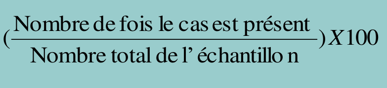
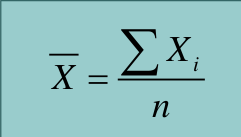
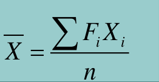
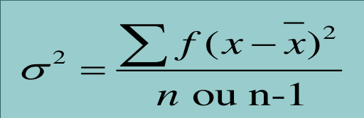
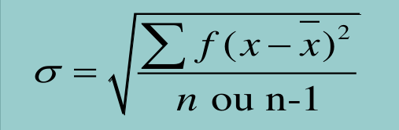

# SPSS (Statistic Package for Social Sciences)

## Renseigner les variables (Affichage des variables) : `Masque de saisie`

1. Nom de la variable 
    - Pas plus de 8 caractères
    - Pas de caractères spéciaux
2. Type de la variable
3. Largeur de la variable
4. Décimales (nombre de chiffres après la virgule)
5. Etiquette (Plus d'informations sur la variable)
<!-- 6.  -->

## Renseigner les données pour chaque individu (Affichage de données)
1. Renseigner toutes les données (Pas de données manquante sous peine d'avoir des observations en moins)
2. Respecter les données de chaque variable sous le même format (Majuscule, Minuscule, etc)
<!-- 3.  -->

## Modifier les valeurs des variables 
1. Première étape

        Transformer > Recoder des variables 

2. Choisir la variable 

3. Changer les variables

        Anciennes et nouvelles valeurs

4. Ecrire les variables

5. Ajouter la modification dans la liste

        Ajouter

6. Enregistrer les changements

        Poursuivre - OK

## Créer une nouvelle variable en se basant sur une ancienne variable
1. Premiere étape

        Transformer > Création de variables

2. Choisir l'ancienne variable

3. Renseigner les informations sur la nouvelle variable (Nom & Etiquette)

4. Donner les valeurs de la nouvelle variable

        Anciennes et nouvelles valeurs

5. Ecrire les variables

6. Ajouter la modification dans la liste

        Ajouter

6. Enregistrer les changements

        Poursuivre - OK

## Définir les valeurs des modalités (`Codification`)
1. Première étape

        Affichage des variables > Valeurs

2. Cliquer sur la case concernée

3. Renseigner les informations sur le code 
(Valeur & Etiquette)

4. Enregistrer les changements

        OK

## Nettoyer la base de données (Epuration)

## Traitement et analyse de la base de données
## `Variable qualitative` 
1. Fréquence : 

        Nombre de fois le cas est présent

2. Pourcentage : 

3. Pourcentage cumulé : 

        Somme des pourcentages précédents

## `Variables quantitatives`
1. Moyenne :  \

2. Distribution de fréquences : \
 

3. Variance : \

4. Ecart-type : \

# Analyse univariée

### `Analyse qualitative`
1. Première étape

        Analyse > Statistiques descriptives  > Effectifs

2. Choisir la variable 

3. Selectionner les paramètres à représenter

        Statistiques

4. Valider la selection

        Poursuivre

5. Afficher les resultats de l'analyse

        OK

### `Analyse quantitative`
1. Première étape

        Analyse >  Statistiques descriptives > Descriptives

2. Choisir la variable 

3. Selectionner les paramètres à représenter

        Options

4. Valider la selection

        Poursuivre

5. Afficher les resultats de l'analyse

        OK

# Analyse bivariée
## Variables qualitatives

### `Croisements entre 2 variables catégorielles`
1. Première étape

        Analyse > Statistiques descriptives > Tableaux croisés

2. Selectionner la variable ligne et la variable colonne

3. Modifier les options pour les cellules

        Cellules

4. Valider la modifications

        Poursuivre

5. Afficher les resultats de l'analyse

        OK

### `Test de khi-deux`
1. Première étape

        Analyse > Statistiques descriptives > Tableaux croisés

2. Selectionner la variable ligne et la variable colonne

3. Selectionner l'option khi-deux

        Statistiques > khi-deux

4. Valider la modifications

        Poursuivre

5. Afficher les resultats de l'analyse

        OK

### `Test t de studient`

## Variables quantitatives 

### `Corrélations`
1. Première étape

        Analyse > Corrélation > Bivariée

2. Selectionner les deux variables 

3. Selectionner plus d'option

        Options

4. Valider la modifications

        Poursuivre

5. Afficher les resultats de l'analyse

        OK

#### `Interpretation des probabilités - Hypothèse` : pSeuil [1%, 5%, 10%]
1. `Ho - Null` (Pas de relation entre les deux variables) 
        
        pCalcul > pSeuil (Ha rejeté)

2. `Ha - Alternative` (Il y a de relation entre les deux variables)

        pCalcul < pSeuil (Ho rejeté)

### `Analyse de regression` : y = ax + b
1. Première étape

        Analyse > Regression > Linéaire 

2. Selectionner la variables dépendante (variable quantitative) et la variable indépendante (variable qualitative)

3. Selectionner plus d'option

        Options

4. Valider la selection

        Poursuivre

5. Afficher les resultats de l'analyse

        OK 

#### `Coefficient de détermination R2 (dégré d'explication de la variable dependante par la variable indépendante)` : R2
- **R deux**
#### `Niveau de signification du coefficient de détermination R2` : ANOVA
- `Ha : ` **p > pSeuil** (Pas significative)
- `Ho : ` **p < pSeuil** (Très significative)

#### `Les coefficients a (constante) et b` 
Voir si **`Sig`** = **`0`** ou **`Sig`** # **`0`** 
- **a ---> Bêta 1**
- **b ---> Bêta 0**

## Variable quantitative et variable qualitative

### `Croisements entre 2 variables dont une est continue` : (variables de type différentes) : pour les variables dichotomiques
1. Première étape

        Analyse > Comparer les moyennes > Moyennes 

2. Selectionner la variables dépendante (variable quantitative) et la variable indépendante (variable qualitative)

3. Selectionner plus d'option

        Options

4. Valider la selection

        Poursuivre

5. Afficher les resultats de l'analyse

        OK 

# Analyse multivariée 

### `Corrélations`
1. Première étape

        Analyse > Corrélation > Bivariée

2. Selectionner la variable dépendante et les variables indépendantes

3. Selectionner plus d'option

        Options

4. Valider la modifications

        Poursuivre

5. Afficher les resultats de l'analyse

        OK

